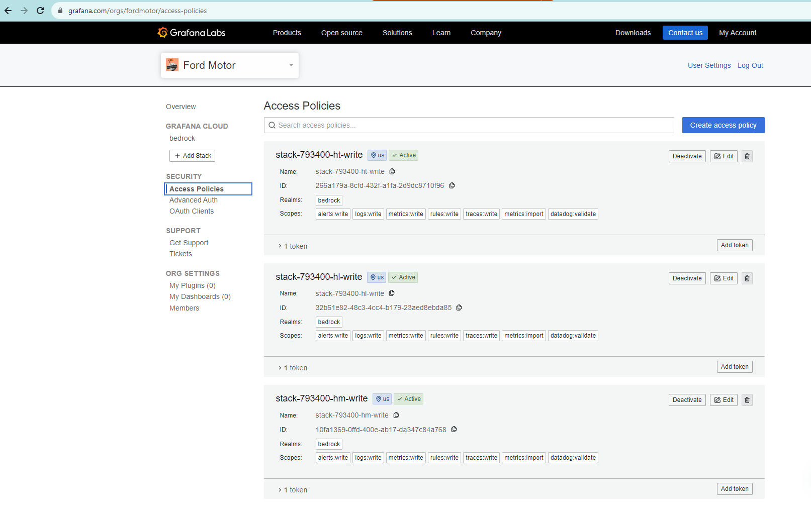
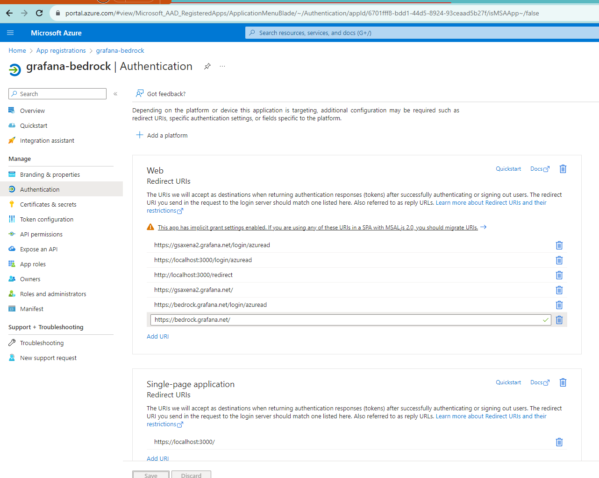

# Bedrock Observability - Grafana OTEL configuration

This guild is intended to showcase how to create and spin up OTEL collectors connected to Grafana Configuration. 

---

## Grafana Configuration

Created Cloud API grafana.com Write API Token for each service that will be consumed. 


This will create `Access Policies` with the token:



We are creating one API Token per service (Loki, Mimir (Prometheus), Tempo) in order to be able to manually configure each of them.

---

## GCP Secret Manager Configuration

We created one secret for each Service ID, Service Token and Service Endpoint in GCP (Live and preview) following the pattern: observability-{tenant}-{service}-{function}.

Those secrets are replicated to every Workload cluster through Kubevela replication police in the `workloadClusterSecretReplication.yaml` observability-cred-replication Application.
The topology serves the purpose of pointing to all Workload clusters at once (region: us-central1).


---

## Adding Single Sing On on Grafana Instance

Add the main grafana path URL in [Azure AD](https://portal.azure.om/#view/Microsoft_AAD_RegisteredApps/ApplicationMenuBlade/~/Authentication/appId/6701fff8-bdd1-44d5-8924-93ceaad5b27f/isMSAApp~/false) (azure ad application was already configured ).
Also add the `login/azuread` end point as this is the endpoint that Grafana will use to connect to the Instance.




Create an Azure AD secret. The Azure AD secret is only valid for 1 year, per Ford standards. 
When the secret renew happens, a new secret need to be created and sent to Grafana team through Ticket to update.

To implement the single sign on in Grafana we need to open a support ticket requesting the configuration changes:


Submit the final Configuration as an attachment for safe transfer of secrets.

`skip_org_role_sync = true` is needed to be able to modify the user role, otherwise it will sync as `Viewer` with Azure AD. `auto_assign_org_role = Editor` need to be capitalized to take effect.

`allowed_domains` and `allowed_groups` can be used to limit users from other tenants to log in when Tenant separation comes into place.

Final configuration:

```
[auth.azuread]
name = Azure AD
allowed_domains = 
allowed_groups = 

enabled = true
allow_sign_up = true
client_id = 6701fff8-bdd1-44d5-8924-93ceaad5b27f
client_secret = u-G8<...secret...>
scopes = openid profile
auth_url = https://login.microsoftonline.com/c990bb7a-51f4-439b-bd36-9c07fb1041c0/oauth2/v2.0/authorize
token_url = https://login.microsoftonline.com/c990bb7a-51f4-439b-bd36-9c07fb1041c0/oauth2/v2.0/token

role_attribute_strict = false
allow_assign_grafana_admin = true
# prevent synchronizing users organization roles
skip_org_role_sync = true
allowed_organizations = c990bb7a-51f4-439b-bd36-9c07fb1041c0
role_attribute_strict = false
allow_assign_grafana_admin = false
use_pkce = true


[users]
viewers_can_edit = true
auto_assign_org_role = Editor

```

---

As part of the configuration, we requested a increase in the number of allowed labels in Prometheus to 60 (default is 40). The Grafana team adverted that this could cause some serious performance issues, but to avoid losing data, we decided to use it for now and implement a label filter in the future to avoid the performance hit.


---

## Backward Compatibility

To avoid downtime in logs during the migration we decided to create `observability-old` namespace with the same components as `observability`.
Creating the `Observability-old` namespace and components, we had port number conflicting issue, forcing us to specify the port number in configuration files to avoid it.
The `kube-state-metrics`, despite not conflicting to the port itself, need to have the port changed, otherwise the data will be duplicated in both instances.

A few of the collectors had default ports for OTLP, not having them declared in the configuration. They needed to be retrieved from the Chart default values to be altered.
To avoid conflicting with other services, we decided to increment 1 in the hundreds digit. 
