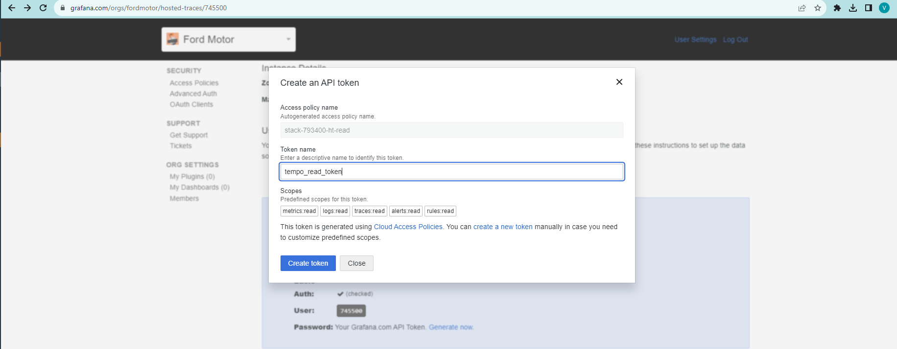

This guild is intended to demonstrate how to create and configure a new Tempo Data Source in Grafana

---

## Motivation

The default Tempo Data Source, pre-configured by Grafana, cannot be modified or updated, limiting the scope for improvements and new functionalities on the original Data Source. For that reason, to enable updates and customizations, a new Tempo Data Source, pointing to the same Tempo service, has to be configured. 

## Tempo Access

In order to have `read` access on Tempo service, a new API token has to be configured on Grafana portal with `*:read` permissions. `*:write` only permissions will not work.

## Grafana Data Source configuration

With the token configured, Grafana requires little information to create a new Tempo Data Source:
- Tempo URL - Available in Grafana Tempo service Details page (URL).
- Tempo Authentication Method - Basic Authentication
- Tempo Username -  Available in Grafana Tempo service Details page (User).
- Tempo Password - Read Token Created in the previews process.

After having configured the main information, click on `Save and Test` to check if the current configuration have connection with Tempo service.

### Customizations

Tempo Explorer tab has a lot of useful functionality that can be configured. 
- For `Traceql-Search` configurations, visit this [link](https://grafana.com/docs/grafana-cloud/send-data/traces/traces-query-editor/traceql-search/).
- For `Trace to logs` configurations, go to `Trace to logs` section and change the Data Source (recommended the use of Loki pre-configured Data Source).
	- This section is intended to users that are investigating the Traces/Spans and click on `Logs for this span` section. The `Tag` is very important to correctly translate the Traces resources names to Logs resources names (i.e.: Traces `service.name` is equivalent to Logs `container` resource).
	- If no log appear with the `Tag` configured, try configuring `Span start time shift` and `Span end time shift` to enlarge the log search time frame. 
	- If `Filter by trace ID` is selected, only logs with the same `Trace Id` as the span will be allowed to be visualized.

#### Additional Settings

On Tempo Datasource, the `Additional Settings` tab has a few customization settings that can be changed for a improved experience. Those include:
- Tempo search fields, that can be changed so that the default search receives custom filters according to specify. 
  - The default ones are `service.name`, which is an always present field for OpenTelemetry to identify a service, and `span name`. 
- Loki Search, where a Loki datasource can be configured for Loki Traces search.

